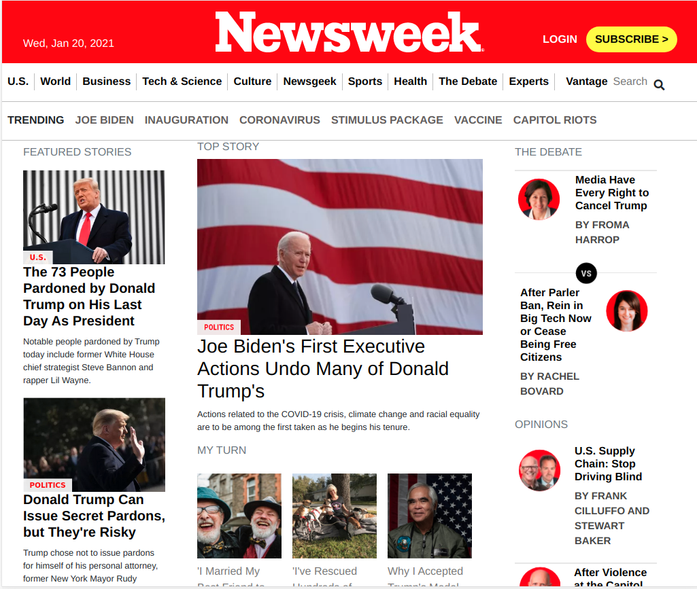
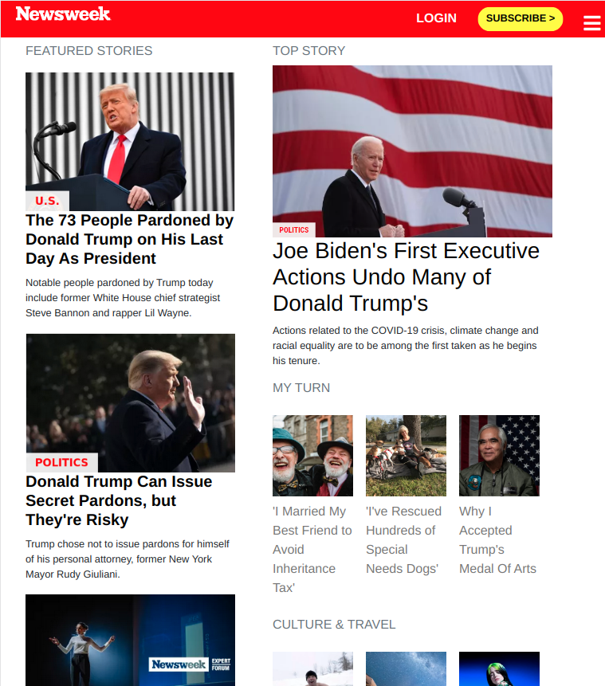
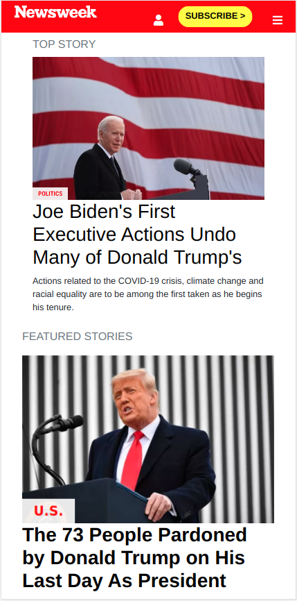

# News Week

> Created this website clone completely with bootstrap

### Desktop view

### Tablet view

### Mobile view

## Built With

- HTML5, CSS3
- Bootstrap Frameworks

## Live Demo

[Live Demo Link](https://garciajordy.github.io/NewsWeek-Project/)

## Instructions
To get a local copy up and running follow these simple example steps.

### Setup
- Clone in the terminal or download this entire [GitHub Repo](https://github.com/garciajordy/NewsWeek-Project) and go to the index.html file.

### Install
- Set up liveserver as an extension in your VS Code.
- If you dont have the live server extension, or are using another software just view directly in your browser.

### Usage
- Right click and open the index.html in your browser to view.

## Authors

👤 **Jordy Garcia**

- GitHub: [@githubhandle](https://github.com/garciajordy)
- LinkedIn: [LinkedIn](https://www.linkedin.com/in/jordy-garcia-675849206/)

👤 **Kaboha Jean Mark**

- GitHub: [@KabohaJeanMark](https://github.com/KabohaJeanMark)
- Twitter: [@jean_quintus](https://twitter.com/jean_quintus)
- LinkedIn: [LinkedIn](https://www.linkedin.com/in/jean-mark-kaboha-software-engineer/)

## 🤝 Contributing

Contributions, issues, and feature requests are welcome!

Feel free to check the [issues page](issues/).

## Show your support

Give a ⭐️ if you like this project!

## Acknowledgments

- Hat tip to Microverse
- Inspiration

## 📝 License

This project is [MIT](./LICENSE) licensed.
